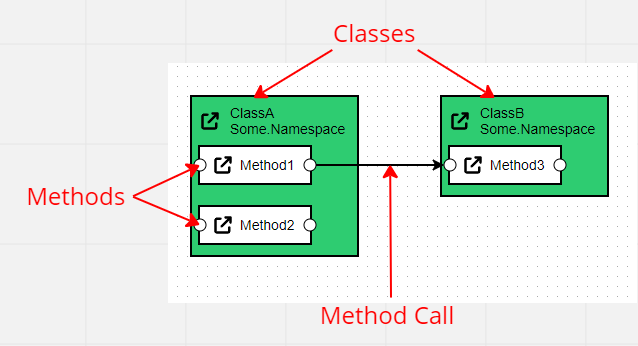

**Debug Notes** is a [diagramming tool](https://yannicklerestif.com/debug-notes) and a [Rider plugin](https://plugins.jetbrains.com/plugin/19357-debug-notes), that allow you to visually represent how some code works, so you can take notes while you're debugging or reverse engineering code, or communicate it to other people.

# 1. Code Elements
The image below shows what code elements look like in Debug Notes:

- **Classes** are represented by green boxes. Each class belongs to a **namespace** indicated below the class name.
- **Methods** are represented by white boxes inside classes.
- **Method Calls** are represented by an arrow from the caller method to the callee method.

# 2. Rider Plugin
If you're not using C#, feel free to skip to the next paragraph!

If you're using C#, you can use the Debug Notes [Rider plugin](https://plugins.jetbrains.com/plugin/19357-debug-notes) to build the diagram right from Rider, and navigate to your code by clicking the diagram.
You can see it in action below (click the image to start the gif):

# 3. Online Editor
You can also create and update diagram elements manually, which works for any language.

You can do that in the Debug Notes [online application](https://yannicklerestif.com/debug-notes), or in the plugin view in Rider if you're using C#.

Here is a demo (click the image to start the gif):

